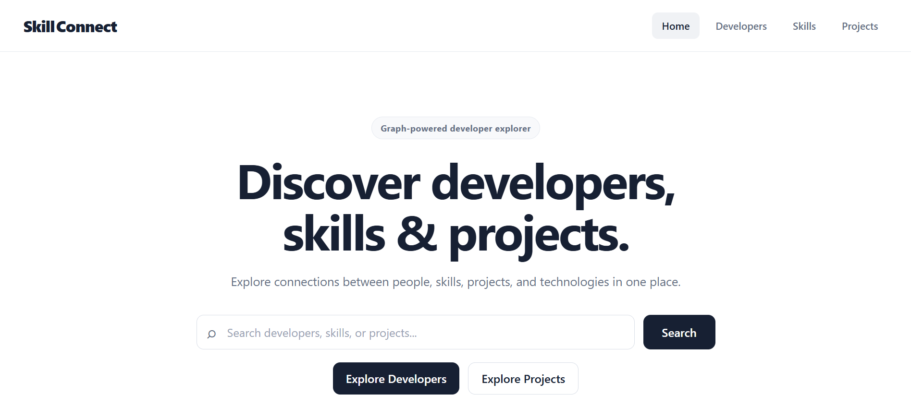
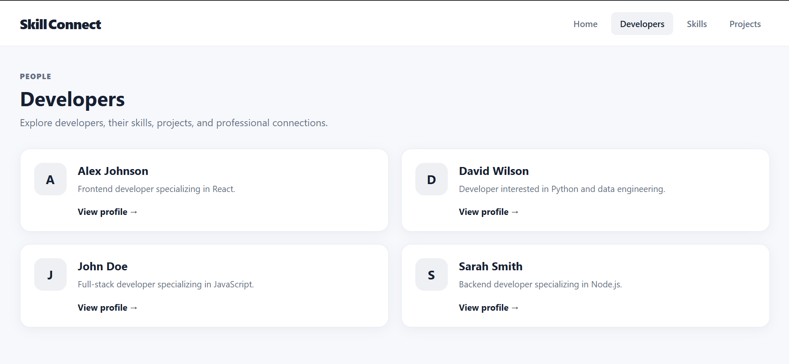
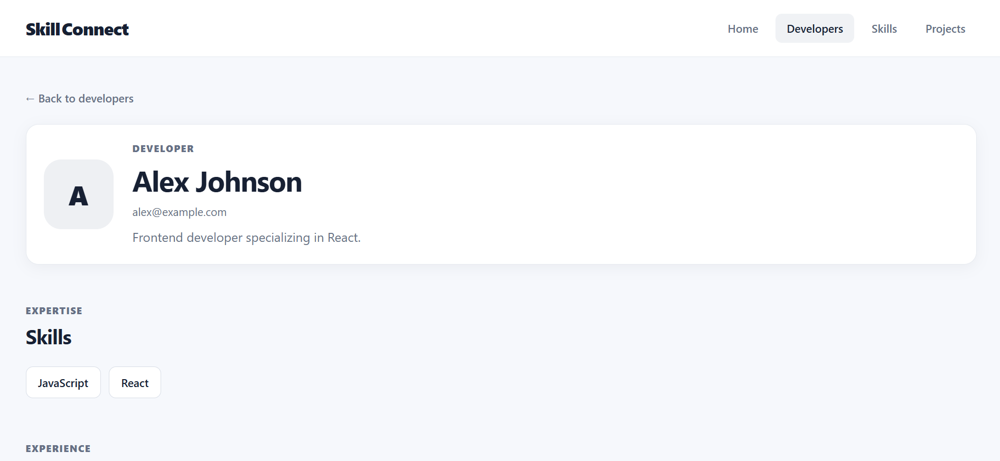
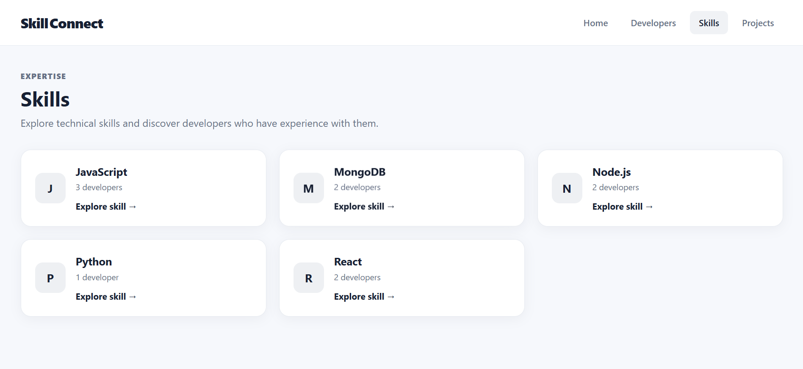
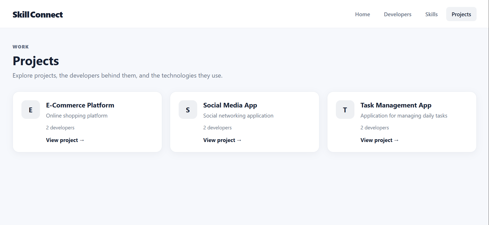
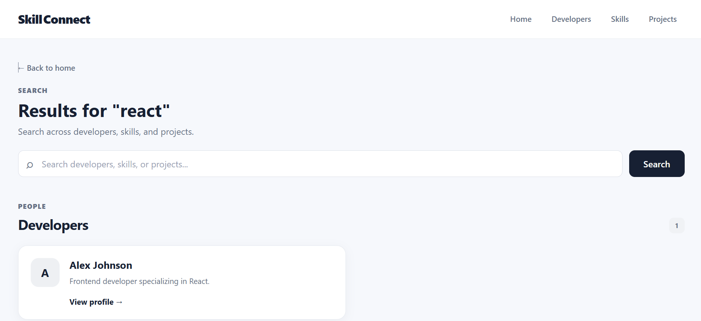
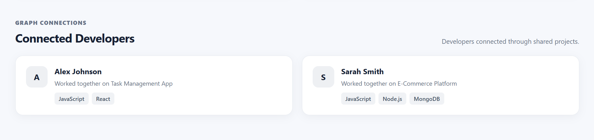

# SkillConnect

SkillConnect is a graph-powered web application for discovering relationships between developers, skills, projects, and technologies.

The application allows users to explore developers, their skills and projects, search across the graph, and discover developers who are connected through shared projects.

## Live Demo

Frontend:
https://skill-connect-kappa.vercel.app/

Backend API:
https://skill-connect-kappa.vercel.app/

## GitHub Repository

https://github.com/akhiljoseph684/SkillConnect/

---

# 1. Use Case

## Problem

In a developer community or organization, it can be difficult to discover meaningful connections between people, skills, projects, and technologies.

Typical questions include:

- Which developers know React?
- Which skills does a particular developer have?
- Which projects did a developer work on?
- Which technologies are used by a project?
- Which developers worked together?
- Which developers are connected through shared projects?

These questions are mainly about relationships between entities rather than isolated records.

## Solution

SkillConnect represents developers, skills, projects, and technologies as nodes in a graph.

Relationships between these nodes allow users to explore the graph naturally.

For example:

Developer → WORKED_ON → Project ← WORKED_ON ← Developer

This makes it possible to discover developers who worked on the same project.

---

# 2. Why a Graph Database?

SkillConnect is relationship-oriented.

A traditional relational database can store developers, skills, and projects using separate tables and junction tables. However, queries involving multiple relationships can become increasingly complex as the number of relationships grows.

In SkillConnect, relationships are first-class elements of the data model.

For example:

Developer
    ↓ WORKED_ON
Project
    ↑ WORKED_ON
Developer

This allows the application to directly traverse the graph to find connected developers.

The graph model is especially useful for questions such as:

- Which developers worked on the same projects?
- What projects are shared between two developers?
- What skills belong to a connected developer?
- What technologies are reachable through a developer's projects?

The graph database therefore provides a natural representation of the application's core use case: discovering connections.

---

# 3. Graph Model

## Nodes

SkillConnect contains the following main node types:

- Developer
- Skill
- Project
- Technology

## Relationships

The main relationships are:

- Developer → HAS_SKILL → Skill
- Developer → WORKED_ON → Project
- Project → USES → Technology

## Graph Diagram

```text
                 ┌─────────────┐
                 │    Skill    │
                 └──────▲──────┘
                        │
                     HAS_SKILL
                        │
                 ┌──────┴──────┐
                 │  Developer  │
                 └──────┬──────┘
                        │
                     WORKED_ON
                        │
                        ▼
                 ┌─────────────┐
                 │   Project   │
                 └──────┬──────┘
                        │
                       USES
                        │
                        ▼
                 ┌─────────────┐
                 │ Technology  │
                 └─────────────┘

## Screenshots

### Home


### Developers


### Developer Details


### Skills


### Projects


### Search Results


### Developer Connections
